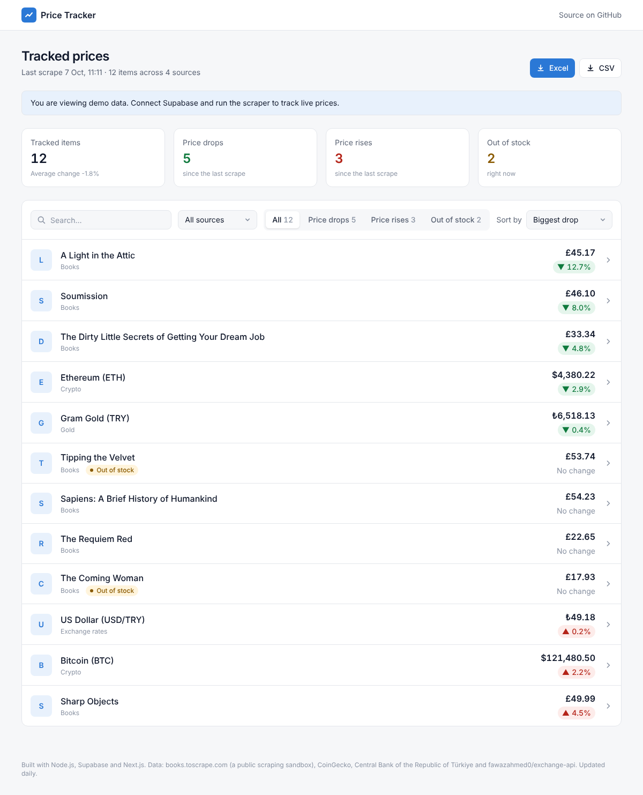
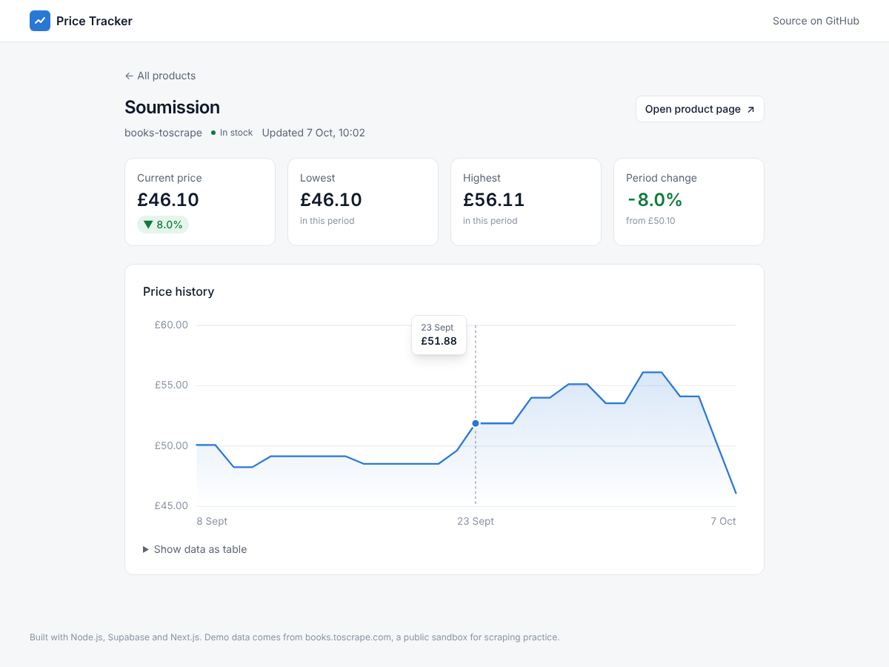
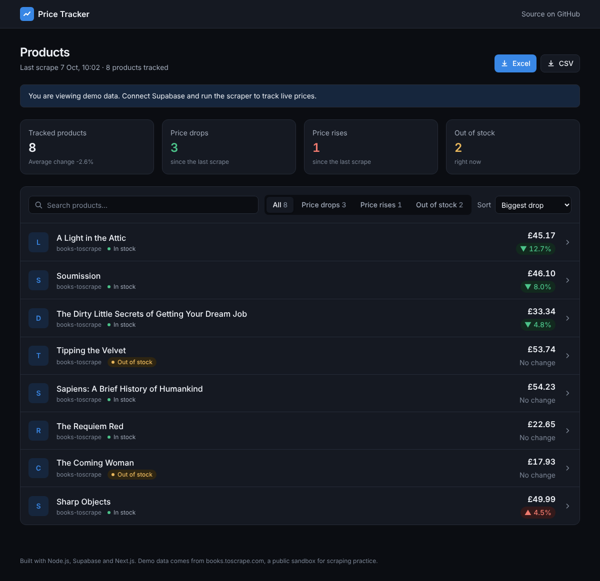

# Price Tracker

**Live demo:** https://price-tracker-sefa-yksn.vercel.app

A Node.js scraper collects prices from four sources on a schedule (an e-commerce catalogue, crypto, exchange rates and gold) and stores every run in Supabase (Postgres). A Next.js dashboard shows current prices, the change since the last run and stock status.





<details><summary>Dark mode</summary>



</details>

## Structure

| Folder | What it does |
| --- | --- |
| `scraper/` | Node.js 20+ collector. One adapter per source (`src/adapters/`): HTML crawling with pagination (books.toscrape.com), JSON APIs (CoinGecko, gold) and XML (Central Bank of Türkiye rates). Polite fetching with retries; one failing source never blocks the others. Saves to Supabase, or to local JSON when no credentials are set. |
| `supabase/migrations/` | Tables `products`, `price_history`, `alerts`, the `product_latest` view and row level security. |
| `web/` | Next.js dashboard: search, filters and sorting, per-product price history chart, Excel and CSV export, light and dark themes. Shows demo data until Supabase is connected. |

## Run it

```bash
# 1. Database: paste supabase/migrations/0001_init.sql into the Supabase SQL editor
# 2. Scraper
cd scraper && npm install
SUPABASE_URL=... SUPABASE_SERVICE_ROLE_KEY=... npm run scrape -- all 3   # or a single source: coingecko, tcmb, gold, books-toscrape
npm test
# 3. Dashboard
cd ../web && npm install
NEXT_PUBLIC_SUPABASE_URL=... NEXT_PUBLIC_SUPABASE_ANON_KEY=... npm run dev
```

## Daily schedule

`.github/workflows/scrape.yml` runs the scraper every day at 06:00 UTC and can be started by hand from the Actions tab. It needs one repository secret: `SUPABASE_SERVICE_ROLE_KEY`.

## Track any product by link

Paste a product page link on the dashboard. The server reads the price from the structured data most shops publish for Google Shopping (JSON-LD `Product`/`Offer`, then `product:price` meta tags), saves it, and the daily job re-checks every added link (`source = custom`). Links that resolve to private network addresses are refused. Needs `SUPABASE_SERVICE_ROLE_KEY` as a server-side environment variable on Vercel.

## Telegram and Google Sheets

Both are optional and switch on when their repository secrets exist:

- **Telegram**: `TELEGRAM_BOT_TOKEN`, `TELEGRAM_CHAT_ID` (and optional `TELEGRAM_MIN_DROP`, default 2%). After each run the bot posts the day's price drops.
- **Google Sheets**: `GOOGLE_SERVICE_ACCOUNT_JSON`, `GOOGLE_SHEET_ID`. After each run the `Latest` tab is replaced with current prices and a row per item is appended to `History`. Share the sheet with the service account's email as Editor.

## Public API

Read-only JSON, no key needed, CORS open. Interactive docs (Swagger UI): [`/docs`](https://price-tracker-sefa-yksn.vercel.app/docs), spec at `/api/openapi.json`.

| Endpoint | Returns |
|---|---|
| `GET /api/products?source=&q=&limit=` | Items with latest price and change |
| `GET /api/products/{id}` | One item |
| `GET /api/products/{id}/history?days=90` | Price per scrape, oldest first |

## Price alerts

Visitors leave an email and a target price on any product page. After every scrape the job emails each alert whose target is reached, once, then marks it sent. Emails go through [Resend](https://resend.com): add a `RESEND_API_KEY` repository secret to switch sending on; without it the job only logs which alerts are due. Alerts are write-only for the public (RLS insert policy, no read access).

## Adding a site

Create `scraper/src/adapters/<site>.js` exporting `name` and either `startUrl` + `parseListing(html, pageUrl)` returning `{ products, nextUrl }` (HTML sites) or `fetchAll()` returning products (APIs), then register it in `src/index.js`.

## Roadmap

- [x] Scraper with pagination and retries, unit-tested parser
- [x] Supabase schema with price history
- [x] Dashboard with price change and stock status
- [x] Price history chart per product (hover tooltip, table view)
- [x] Excel (.xlsx) and CSV export (`/api/export?format=xlsx|csv`, spreadsheet-safe)
- [x] Search, filters (drops, rises, out of stock) and sorting
- [x] Light and dark themes, mobile layout
- [x] Multiple sources: crypto (CoinGecko), exchange rates (TCMB XML), gold
- [x] Public JSON API with OpenAPI spec and Swagger UI
- [x] Track any product by pasting its link (JSON-LD / meta price extraction)
- [x] Google Sheets sync
- [x] Telegram price-drop digest
- [x] Price-drop email alerts (sign up on the product page, sent after each scrape via Resend)
- [x] Daily schedule (GitHub Actions cron)
